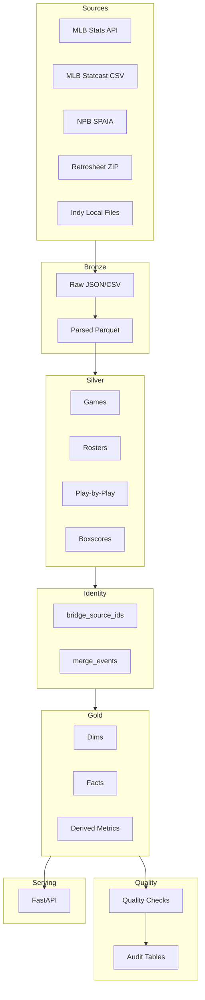
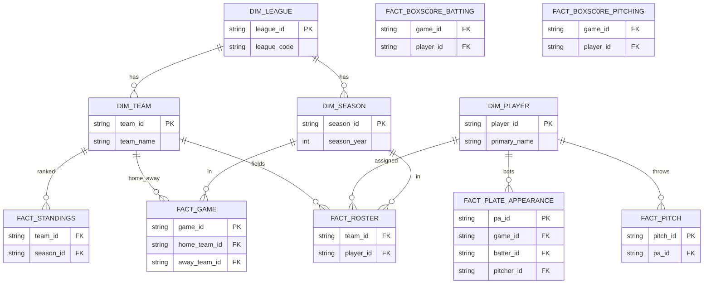

# GBDP End-to-End Documentation

This document describes the full end-to-end product: ingestion, lakehouse layers, identity resolution, quality checks, orchestration, and serving. It is written to support both local development and Databricks deployment.

**Status:** The pipeline runs end-to-end with MLB, NPB, Retrosheet, and optional Indy data. It supports nightly windows, backfills, deterministic IDs, and Delta output on Databricks.

---

**1. Architecture Overview**

GBDP is a nightly batch lakehouse with a bronze/silver/gold contract, identity resolution, and read-only API.

**Components**
1. **Connectors**: MLB Stats API, Statcast, NPB SPAIA, Retrosheet (local zip), Indy (local files).
2. **Bronze**: Raw payloads + parsed tables for replayability and audit.
3. **Silver**: Normalized domain tables (games, rosters, PBP, boxscores).
4. **Identity**: Deterministic canonical IDs + manual override audit.
5. **Gold**: Canonical dims and facts, plus derived metrics.
6. **Quality**: Uniqueness, referential integrity, row counts, coverage, schema drift.
7. **Serving**: FastAPI read-only API over gold tables.
8. **Orchestration**: CLI stage runner with retries, backfill, and nightly window.

**Architecture Diagram (Mermaid)**


---

**2. Storage Layout**

All data is partitioned by `dt=YYYY-MM-DD`.

**Bronze**
- `data/bronze/raw/<source>/<entity>/dt=YYYY-MM-DD/*.json.gz`
- `data/bronze/parsed/<source>/<entity>/dt=YYYY-MM-DD/*.parquet`

**Silver**
- `data/silver/<source>/<entity>/dt=YYYY-MM-DD/part-*.parquet`

**Gold**
- `data/gold/<table>/dt=YYYY-MM-DD/part-*.parquet`

Set `GBDP_STORAGE_FORMAT=delta` on Databricks to write Delta instead of Parquet.

---

**3. Connectors**

**MLB**
1. Stats API: schedule, rosters, transactions.
2. Statcast CSV: pitch-level data.

**NPB (SPAIA)**
1. Schedules, rosters, standings.
2. Games, play-by-play, pitch-by-pitch.

**Retrosheet**
1. CSVs inside `data/manual/csvdownloads.zip`.
2. Reads `allplayers`, `gameinfo`, `teamstats`, `batting`, `pitching`, `fielding`, `plays`.

**Indy (optional)**
1. Local JSON files under `data/manual/indy/`.

---

**4. Bronze Contract**

**Raw JSON**
1. Payloads are stored exactly as fetched.
2. Request metadata includes URL, params, status, checksum, fetched time.
3. Idempotent writes unless `--force` is used.

**Parsed Parquet**
1. Minimal normalization.
2. Nested fields are JSON strings.
3. Partition columns are not included by default to avoid schema merge issues.

---

**5. Silver Contract**

Silver is normalized and deduplicated per entity. Examples:
1. **MLB**
   - `games`, `rosters`, `transactions`, `pitches`.
2. **NPB**
   - `games`, `rosters`, `game_pbp`, `standings`.
3. **Retrosheet**
   - `games` (from `gameinfo`)
   - `rosters` (from `allplayers`)
   - `boxscore_batting`, `boxscore_pitching`
   - `game_pbp` (from `plays`)

Silver can be overwritten with `--force`.

---

**6. Identity Resolution**

**Canonical IDs**
1. Deterministic ULID-like IDs via `utils/ids.py`.
2. Identity bridges stored in `gold/bridge_source_ids`.

**Manual Overrides**
1. `manual_entity_links.csv` is authoritative.
2. Overrides are recorded in `gold/merge_events`.

---

**7. Gold Tables**

**Dims**
1. `dim_league`, `dim_team`, `dim_player`, `dim_season`

**Facts**
1. `fact_game`
2. `fact_roster`
3. `fact_transaction`
4. `fact_pitch`
5. `fact_plate_appearance`
6. `fact_boxscore_batting`
7. `fact_boxscore_pitching`
8. `fact_standings`

**Derived**
1. `run_expectancy`
2. `breakout_candidates`

Retrosheet and Indy data are mapped into the same canonical tables.

**Data Model Diagram (Mermaid)**


---

**8. Event Normalization and Base/Outs**

**Retrosheet**
1. `plays.csv` flags are mapped to canonical events (HR, 1B, BB, K, etc.).
2. Base state is reconstructed from `br*_pre` and `br*_post`.
3. Outs are reconstructed from `outs_pre` and `outs_post`.

**MLB Statcast**
1. PA keys are derived from `game_pk`, `at_bat_number`, and batter ID.

---

**9. Quality Checks**

**Checks**
1. Uniqueness constraints for gold keys.
2. Referential integrity checks (e.g., pitch → PA).
3. Row count sanity thresholds.
4. Coverage thresholds (pitch coverage by games).
5. Schema drift detection for bronze parsed tables.

Outputs are written to `gold/audit_quality`.

---

**10. Orchestration**

**Stages**
1. `fetch_schedules`
2. `fetch_rosters`
3. `fetch_transactions`
4. `fetch_games`
5. `fetch_pbp`
6. `fetch_pitches`
7. `silver_normalize`
8. `identity_resolve`
9. `gold_publish`
10. `quality_checks`
11. `audit_report`

**Runner**
1. `gbdp run` runs all stages.
2. `--stages` can limit to a subset.
3. `--retries` and `--retry-delay` control stage retries.
4. Stage audit is stored in `gold/audit_stage_runs`.

---

**11. Backfills**

Use `gbdp backfill` with explicit date ranges and `--force` for full rebuilds.

**Example**
```bash
python -m gbdp.cli backfill --start 1960-04-12 --end 1960-04-19 --force
```

---

**12. Nightly Window**

The nightly window defaults to yesterday + previous 6 days.

**Example**
```bash
python -m gbdp.cli run --start 2000-01-01 --end 2000-01-01 --window nightly
```

---

**13. API Serving**

FastAPI is read-only and serves gold tables.

**Endpoints**
1. `GET /health`
2. `GET /leagues`
3. `GET /teams?league=MLB`
4. `GET /players?query=ohtani`
5. `GET /games?date=YYYY-MM-DD`
6. `GET /games/{game_id}`
7. `GET /players/{player_id}/stats`
8. `GET /run-expectancy`
9. `GET /breakout-candidates`

**Run**
```bash
python -m gbdp.cli serve --host 0.0.0.0 --port 8000
```

---

**14. Databricks Deployment**

**Repo path**
`Workspace/Repos/eric.t.seppanen@gmail.com/GBDP`

**Jobs**
1. `configs/databricks_job.json` for nightly runs.
2. `configs/databricks_backfill_job.json` for manual backfills.

Set `GBDP_STORAGE_FORMAT=delta` and ensure PySpark is available.

**Recommended volume mapping**
```
GBDP_BRONZE_ROOT=dbfs:/Volumes/gbdp/bronze_gbdp/bronze_vol/gbdp/bronze
GBDP_SILVER_ROOT=dbfs:/Volumes/gbdp/silver_gbdp/silver_vol/gbdp/silver
GBDP_GOLD_ROOT=dbfs:/Volumes/gbdp/gold_gbdp/gold_vol/gbdp/gold
GBDP_MANUAL_ROOT=dbfs:/Volumes/gbdp/bronze_gbdp/bronze_vol/gbdp/manual
```

---

**15. Environment Variables**

**Required**
1. `GBDP_DATA_ROOT`
2. `GBDP_STORAGE_FORMAT` (`parquet` or `delta`)

**Optional**
1. `GBDP_USER_AGENT`
2. `GBDP_HTTP_TIMEOUT`
3. `GBDP_HTTP_RETRIES`
4. `GBDP_HTTP_BACKOFF`
5. `GBDP_HTTP_MIN_INTERVAL`
6. `GBDP_INCLUDE_PARTITION_COLS`
7. `GBDP_INCLUDE_PARTITION_COLS_SILVER`
8. `GBDP_ID_SALT`

---

**16. Local E2E Example**

```bash
python -m gbdp.cli run --start 1960-04-12 --end 1960-04-12 --stages fetch_games,silver_normalize,identity_resolve,gold_publish,quality_checks
```
